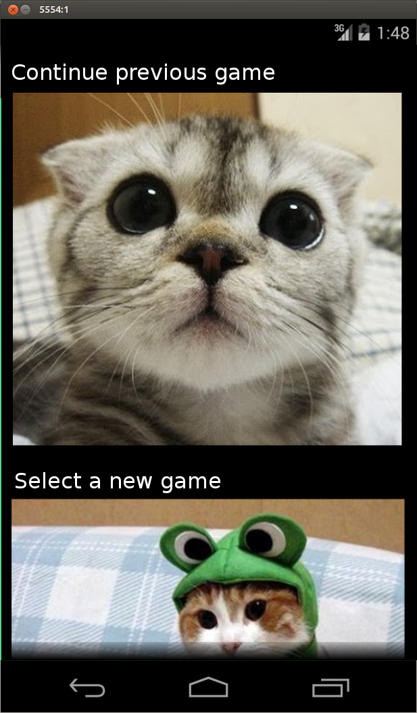
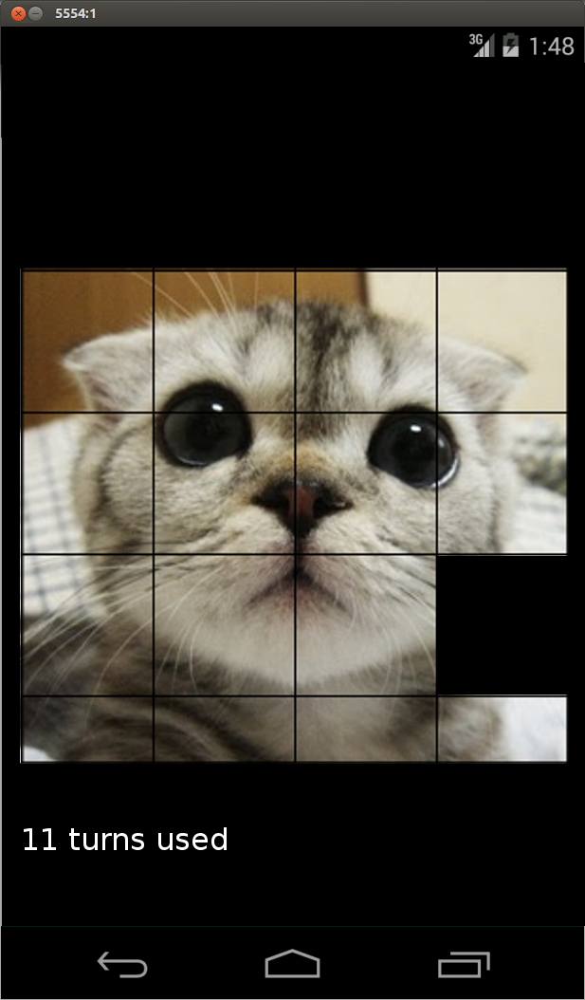
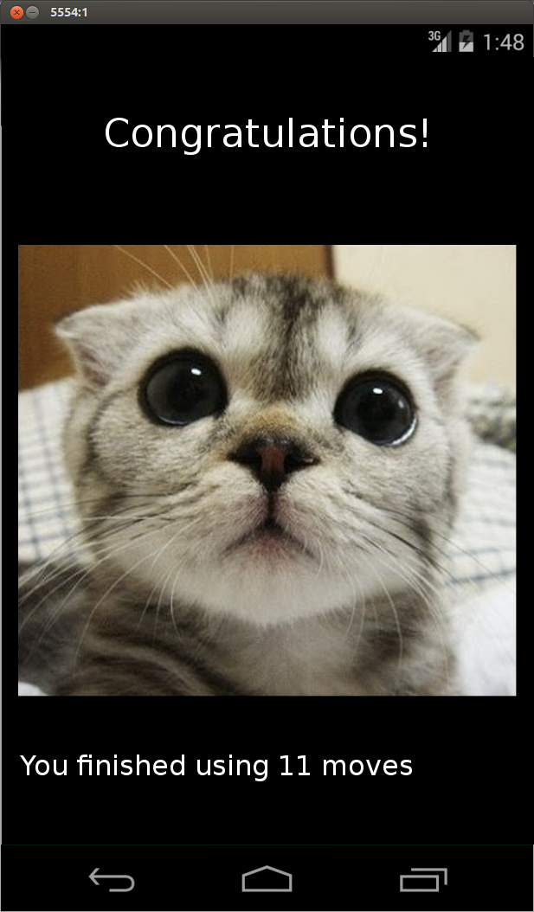

nPuzzle10340912
===

The nPuzzle consists of a tile based puzzle in which the tiles are to be ordered. The order depends
on the image displayed on the tiles or the numbers. Tiles can be moved in a four-connected manner towards
the empty tile.

Features
===

Allows user to:

-select an image from the folder "res/drawable/".
-select a difficulty which translates into a field size.
-tap on the tile that should move to the empty place.
-view the amount of turned it has already used
-change difficulty while playing a puzzle.
-reset the game while in game.
-receive a conformation when the puzzle is solved.

Allows app to:

-return to a saved state from a previous session.
-automatically generate tiles from a selected picture.
-switch between the three different screens when the user desires to.

Activities
===

select game

play game

finished game

