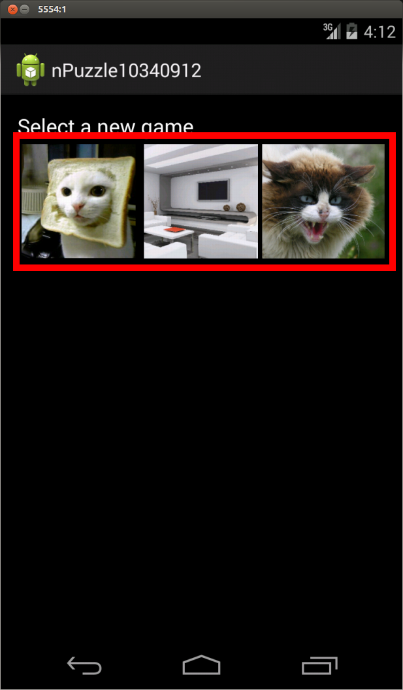
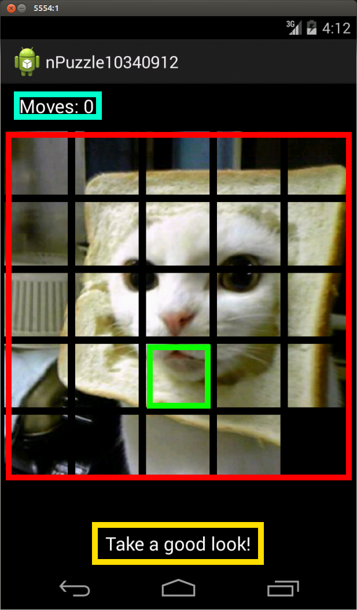
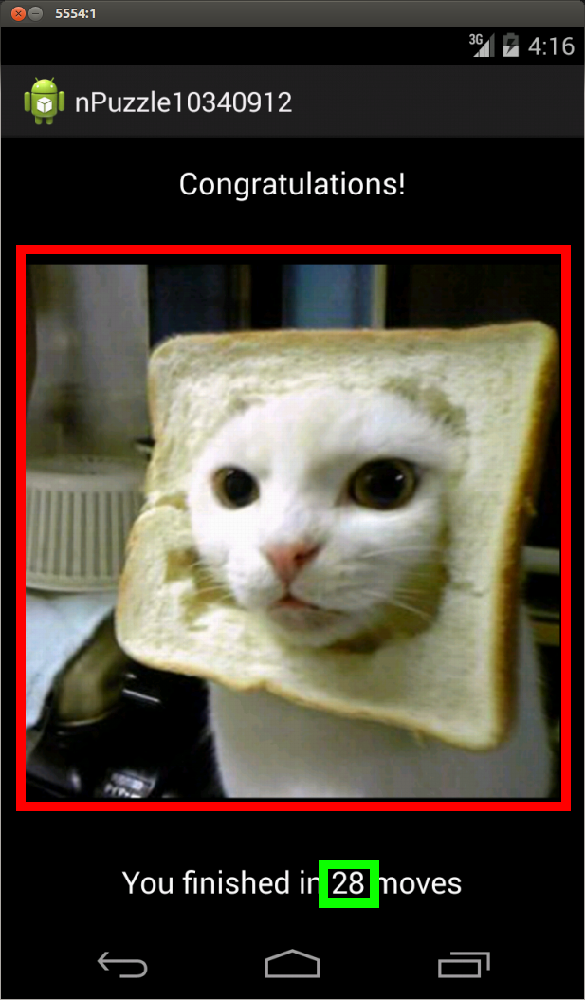

Design Document
===============

## Activities

#### ImageSelection Activity

##### Red
The ImageAdapter class with SquareImageView as tiles. All resources in the drawable folder 
whose name start with "npuzzle" are drawn here. When an image is clicked the GamePlay activity is 
started and the selected image is parsed as an argument to that new activity.

***

#### GamePlay Activity

##### Red
The GameField that holds all the GameTiles. When a GameTile is tapped it is first selected. A green outline
will appear. When a second tile is tapped the GameField will check if the move is valid. If it is the
two tiles will be switched. If it is not valid a error message will be displayed using the Toast lib.

Three seconds after this activity is loaded the tiles will be shuffled.

When the puzzle is solved (the tiles are restored to the correct order) the final activity YouWin will
be loaded.

##### Green
An example of a single GameTile.

##### Cyan
Here the amount of moves the user has made is displayed. A move is only counted when it is a valid one.

##### Yellow
The "take a good look" message will disappear after three seconds. At this time the tiles will also be shuffled.

***

#### YouWin Activity

When the user taps somewhere on the screen, the first activity (ImageSelection) is loaded again and a
new game can be loaded.

##### Red
The image that was used to create the puzzle is parsed by the previous activity (GamePlay) and is displayed
again here.

##### Green
The amount of moves the user used is also parsed to this activity and displayed.

***

## JAVA Classes

#### Structure

All JAVA classes are ordered as followed:

├── GamePlay.java   
├── ImageSelection.java   
├── PuzzleGame   
│   ├── GameField.java   
│   └── GameTile.java   
├── Utils   
│   ├── BitmapLoader.java   
│   └── SquareImageView.java   
└── YouWin.java   

***

#### ImageSelection

##### public class ImageSelection extends ActionBarActivity
- The main activity of this application. It will start when the app is loaded. Of type ActionBarActivity.

---

##### private void switchToGamePlay( int imageIndex )
- Changes to the next activity GamePlay and passes the resource id of the selected image.   

int imageIndex: the position of the selected image in the GridView of this activity.

---

##### public boolean onOptionsItemSelected(MenuItem item)
- Action handler for the menu in this activity.   

MenuItem item: the selected item in the menu. A action can follow according to which item was selected.

---

##### public static int[] IMAGES()
- Returns all resource ids of images in the drawable folder whose name starts with "npuzzle".

***

#### ImageAdapter

##### public class ImageAdapter extends BaseAdapter
- A basic adapter that can hold images. Used to display square preview images in the selection activity.

---

##### public ImageAdapter( Context context, int screenWidth )
- Constructor in of the image adapter.   

Context context: the context in which the adapter is going to be used.   
int screenWidth: the screen width of the application, later used to scale the preview images in the grid.

---
        
##### public int getCount()
- Get the amount of items in the grid.  
 
---
        
##### public Object getItem(int position)
- Get an Object based on the position in the grid

int position: the position of the item in the grid.

---
        
##### public long getItemId(int position)
- Get the id of an item based on the position of the item in the grid.

int position: the position of the item in the grid.

---
        
##### public View getView(int position, View convertView, ViewGroup parent)
- return how the View of the items in this adapter should be based on the position, View and Viewgroup

int position: the position of the item in the grid.   
View concertView: if the item exist already it is given in this variable.   
ViewGroup parent: the GridView that is the parent of the item.   

***

#### GamePlay

##### public class GamePlay extends ActionBarActivity
- Class that is the second activity of this application. Contains the actual puzzle. Also adds an click
listener to the game which handles the moves of the tiles in the puzzle.

---

##### protected void onCreate(Bundle savedInstanceState)
- Function that is called when the activity is started. Will create the puzzle and display it.

Bundle savedInstanceState: the state of the application in a previous execution

---

##### public void switchToCongratulate()
- Switch to the next activity to congratulate the user. Called when the tiles of the puzzle are in
the correct order

---

##### protected void onResume()
- Called after the activity is fully loaded. Used to first display the puzzle in its correct state. 
After three seconds the pieces are shuffled.

---

##### public void updateMovesDisplay()
- Upates the amount of moves the user has made on the display

***

#### YouWin

##### public class YouWin extends ActionBarActivity
- Class that holds the third and last acivity of the application. Congratulates the user, displays the 
image that was used in the puzzle and the amount of moves the user used to complete te puzzle.

---

##### protected void onCreate(Bundle savedInstanceState)
- Creates the activity and sets the amount of moves and the images as parsed from the previous activity.

Bundle savedInstanceState: the state of the application in a previous execution

---

##### public void switchToImageSelect()
- Switch back to the first activity (ImageSelection) when the user clicks somewhere on the screen.

***

#### GameField

##### public class GameField extends BaseAdapter
- Class that holds the actual game. Doubles as a GridView for easy integration.

---

##### public void scrambleField()
- Scrambles the tiles of the puzzle by inverting the order.

---

##### public void createTiles( int gameSize, int desiredWidth )
- Creates all the tiles based on the selected image.

int gameSize: the size of the rows and columns of the game   
int desiredWidth: the desired width of the tiles in the puzzle

---

##### public void setSelected( int position, boolean selected )
- Set a tile of the puzzle selected or not based on the position

int position: the position of the tile whose selected state is to be changed.   
boolean selected: whether or not the selected state should be turned on or off.

---

##### public boolean switchTiles( int position1, int position2 )
- Switch two tiles around based on there position, returns true when the movement complies with the rules

int position1: the position of the first tile   
int position2: the position of the second tile

---

##### public boolean moveIsValid( GameTile source, GameTile destination )
- Checks whether a move of two tiles is valid based on their location in the game field.

GameTile source: the first tile that is to be moved.   
GameTile destination: the second tile that is to be moved.

---

##### public int getCount()
- Returns the amount of items in the game field.

---

##### public Object getItem(int position)
- Returns the GameTile based on its position in the game field.

int position: the position of the GameTile in the game field that is to be returned.

---

##### public long getItemId(int position)
- Return the item id of the GameTile at the position specified.

int position: the position of the GameTile whose id is to be returned.

---

##### public View getView(int position, View convertView, ViewGroup parent)
- Return the view of the item according to its position. Uses the GameTiles according to their set
position on the field.

int position: the position of the item in the grid.   
View concertView: if the item exist already it is given in this variable.   
ViewGroup parent: the GridView that is the parent of the item.  

***

#### GameTile

##### public class GameTile
- This class contains all information of a single GameTile. It contains the image, coordinates, id,
whether or not the tile is selected or not and if this tile is the empty tile.

---

##### public GameTile( Bitmap bitmap, int x, int y, int id, boolean empty )
- The constructor of this class that takes all information needed.

Bitmap bitmap: the image that is to be displayed in this tile.   
int x: the x coordinate of this tile.   
int y: the y coordinate of this tile.
int id: the id of this tile which is the correct order of the tiles (Position 1 is id 1 etc).
boolean empty: whether or not this tile is the empty tile.

---

##### public boolean equals( GameTile tile )
- Returns true when the coordinates of this tile and another tile are the same.

GameTile tile: the other tile used to compare the coordinates.   

---

##### public boolean isAdjacent( GameTile tile )
- Returns true when this tile and another tile are adjacent (four-connected)

GameTile tile: the other tile used to compare.

##### public void setSelected( boolean selected )
- Set whether or not a tile is selected or not.

boolean selected: the state of the selection of this tile.

***

#### BitmapLoader

##### public class BitmapLoader
- Utility class used to load Bitmaps and rescale them.

---

##### public static Bitmap loadScaledBitmapFromResource( Context context, int resourceId, int width )
- Returns a scaled BitMap from a resourceId. Scaled the image while mainting its original aspect ratio.
Uses the BitFactory library.

Context context: the activity in which the method is used.   
int resourceId: the resourceId of the image that is to be loaded and scaled.   
int width: the desired width of the loaded image.   

***

#### SquareImageView

##### public class SquareImageView extends ImageView
- Class that holds a square ImageView

---

##### public SquareImageView(Context context)
- The default constructor of an ImageView

---

##### protected void onMeasure(final int widthMeasureSpec, final int heightMeasureSpec)
- When the ImageView is measured the height is updated to be the same as the width in order to make the image square.

final int widthMeasureSpec: the width of the SquareImageView.   
final int heightMeasureSpec: the height of the SquareImageView.   

---

##### protected void onSizeChanged(final int w, final int h, final int oldw, final int oldh)
- When the size is changed the height is changed to be the same as the width;

final int w: the new with of the view.   
final int h: the new height of the view.   
final int oldw: the old width of the view.   
final int oldh: the old height of the view.

***

## Libraries

#### Toast
The toast library is used to display error messages. More specific, when a invalid move is made.

#### BitmapFactory
This library is used to load bitmaps, to rescale them and to draw small portions of a image to create 
the individual GameTiles.

## comment: difficulties.restore states